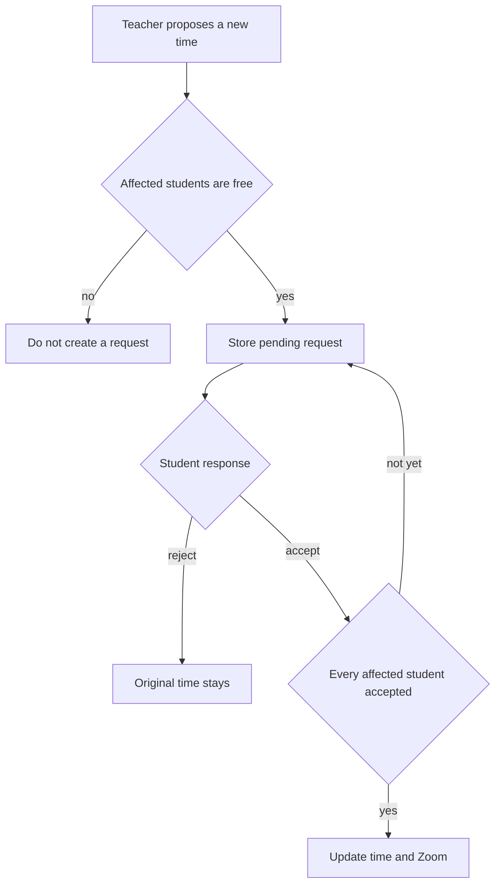

# Session rescheduling

Only the teacher can propose a new time. Students cannot start a reschedule. The current time stays until the affected students accept. A rejection, or no answer before the cutoff, leaves the original time in place.

The product calls a package “A series of classes”: 3–20 hours, split into topics of 1–3 hours each (`SubjectTopic`). There are two of them:

- One student plus a series is `SINGLE_PACKAGE`. The student picks a time per topic at checkout. Each topic becomes its own `Booking`. The teacher reschedules one topic booking, and that one student must accept.
- A group plus a series is `MULTI_PACKAGE`. The teacher sets `scheduledAt` on each topic when the course is created. Students enroll in the whole series. The teacher reschedules one topic at a time. Every confirmed enrollee must accept before that topic’s `scheduledAt` changes. The other topics stay put.

Private (`SINGLE_STUDENT`, each `SINGLE_PACKAGE` topic): one student must accept. Then update that `Booking` and its Zoom meeting.

Group (`MULTI_STUDENT`, each `MULTI_PACKAGE` topic): the time is shared, so every confirmed enrollee must accept before `Subject.scheduledDateTime` or `SubjectTopic.scheduledAt` changes. One rejection cancels the proposal. Students still cannot move only their own seat.

## Schema

Yes. Two new models in `api/prisma/schema.prisma`. Existing booking and subject columns are not enough, because the new time must sit somewhere while it is still pending.

`RescheduleRequest`

- `id`, `status` (`PENDING`, `ACCEPTED`, `REJECTED`, `EXPIRED`)
- `teacherProfileId`
- `bookingId` optional, for a private session
- `subjectId` optional, for `MULTI_STUDENT`
- `subjectTopicId` optional, for one `MULTI_PACKAGE` topic
- `newDate`, `newTime`
- `createdAt`
- Exactly one of `bookingId` or the subject/topic target is set
- One `PENDING` request per booking, subject, or topic

`RescheduleDecision`

- `id`, `requestId`, `studentProfileId`
- `status` (`PENDING`, `ACCEPTED`, `REJECTED`)
- Unique on `(requestId, studentProfileId)`
- Private requests get one row. Group requests get one row per confirmed enrollment.

When the request becomes `ACCEPTED`, write the existing columns:

- Private: `Booking.bookingDate`, `Booking.bookingTime`, then patch that booking’s Zoom meeting.
- Group: `Subject.scheduledDateTime` or `SubjectTopic.scheduledAt`, then patch `subject.zoomMeetingId`.

No new columns on `Booking` or `Subject`. `ClassReminderDispatch` already keys on the start time, so the applied time gets a new reminder without a schema change there.

## Rules

- Propose is teacher-only. Accept and reject are the student on that decision row.
- Propose only if the session starts more than 24 hours from now. A still-pending request expires once that window closes, and the original time remains.
- At propose time, conflict-check the teacher and every affected student, excluding the session being moved. If anyone is busy, do not create the request.
- Check again inside a transaction with `lockBookingProfiles` at the moment the last acceptance applies the change. If the slot was taken in between, mark the request expired and do not write.
- A new proposal from the teacher replaces the previous pending request for that same session.
- No Stripe change. Zoom is patched with `updateZoomMeeting` in `api/services/zoomService.js` only after acceptance, not when the teacher proposes.

## API

- `POST /api/bookings/:bookingId/reschedule` — teacher, private booking, body `{ date, time }`
- `POST /api/subjects/:subjectId/reschedule` — teacher, `MULTI_STUDENT`
- `POST /api/subjects/:subjectId/topics/:topicId/reschedule` — teacher, `MULTI_PACKAGE`
- `POST /api/reschedule-requests/:id/accept` — the student
- `POST /api/reschedule-requests/:id/reject` — the student

Notify on propose (students need to respond), on reject (teacher), and when the new time is actually applied.

## App

`getUpcomingClasses` in `api/controllers/bookingController.js` must include group sessions, not only `Booking` rows.

- Teacher: Reschedule opens the date/time picker and shows the request as pending until the students respond.
- Student, private: Accept or Reject on that session. No way to pick a different time.
- Student, group: same Accept or Reject. Copy should say the class moves only if everyone accepts.

## Testing note

Clone the current MySQL database into an empty database and point `DATABASE_URL` at that clone before applying the new tables. Leave `SHADOW_DATABASE_URL` as a separate empty database. Point `DATABASE_URL` back at the original URL to leave the original database unchanged.

## Out of scope

Student-proposed times, parent responses, moving only some students in a group, refunds, and duration or capacity changes.
